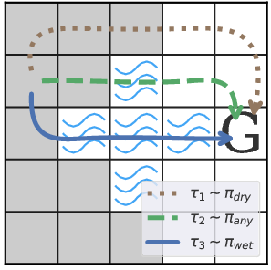

# puddle-world

A simple multi-modal discrete OpenAI Gym RL environment.
In this stochastic grid world environment, an agent must navigate to a single goal
state as fast as possible.
Depending on the current reward mode, the agent must also try and;

 * `dry` mode: Avoid wet squares (-100 reward for touching one)
 * `wet` mode: Avoid dry squares (-100 reward for touching one)
 * `any` mode: Ignore wet/dry status of squares (no penalty for touching either)



## Installation

This package is not distributed on PyPI - you'll have to install from source.

```bash
git clone https://github.com/aaronsnoswell/puddle-world.git
cd puddle-world
pip install -e .
```

To check the installation;

```python
from puddle_world.envs.puddle_world_env import demo
demo()
```

This will instantiate the canonical 5x5 PuddleWorld environment (shown in the figure
above), and print an ASCII representation of it, similar to the below;

```
+-----+
|     |
|@ #  |
| ###G|
|  #  |
|     |
+-----+
```

## Usage

A general randomized PuddleWorld environment is registered with OpenAI Gym.
The constructor takes the desired width and height.
Optional arguments include the reward mode `dry`, `wet` or `any`, as well as
a random seed.

```python
import gym
from puddle_world.envs import *
env = gym.make("PuddleWorld-v0", width=5, height=5, mode='dry', seed=1337)
print(env._ascii())
```

To train a `stable-baselines` agent;

```python
from stable_baselines.common.policies import MlpPolicy
from stable_baselines import PPO2

ppo2_model = PPO2(MlpPolicy, env, verbose=1)
ppo2_model.learn(total_timesteps=int(60e4))
```

This should converge to an approximately optimal policy after around 20k training steps.

## Canonical Environment

The 'Canonical' PuddleWorld environment is a fixed 5x5 world where the agent starts at
the left and must avoid a single central lake to reach the goal on the right.
This environment is show in the figure above.
You can instantiate this as follows;

```python
import gym
from puddle_world.envs import *
env = CanonicalPuddleWorldEnv(mode='wet')
```